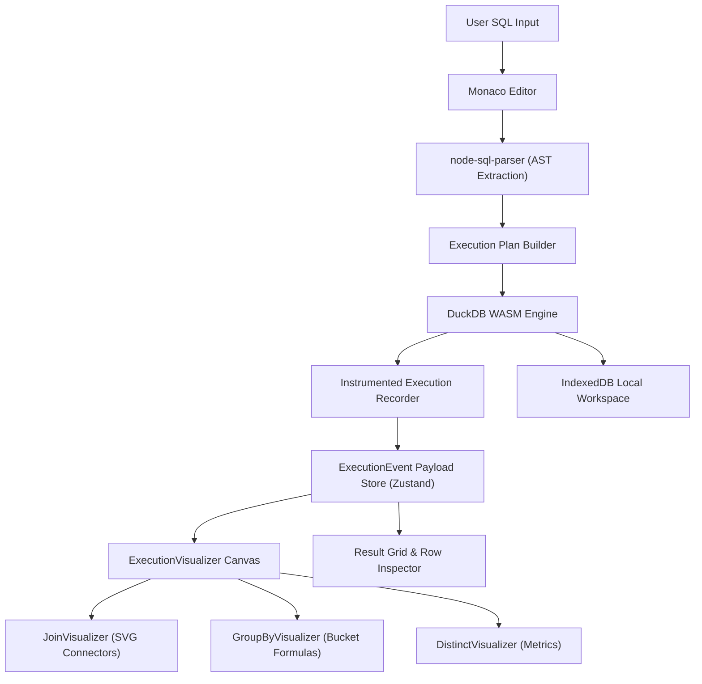

# SQL IDE + Query Debugger + Relational Execution Visualizer

[](https://watashi-00.github.io/sql-viewer/)
[](https://github.com/watashi-00/sql-viewer/actions)

An in-browser SQL IDE, step-by-step query execution debugger, and relational operator visualizer powered by **DuckDB-WASM** and **React 18**.

**Live Application:** [https://watashi-00.github.io/sql-viewer/](https://watashi-00.github.io/sql-viewer/)

---

## Technical Overview

`sql-viewer` compiles and executes standard SQL queries entirely client-side using WebAssembly (`@duckdb/duckdb-wasm`). Rather than treating query execution as a black-box operation, the application parses the SQL Abstract Syntax Tree (AST), instruments query stage breakdowns, and records intermediate relation states across relational algebra operators (`FROM`, `JOIN`, `WHERE`, `GROUP BY`, `HAVING`, `SELECT`, `DISTINCT`, `ORDER BY`, `LIMIT`).

Users can step through query execution using a deterministic state machine, inspecting how individual tuples flow, match, aggregate, or get filtered out at each stage of execution. The application also supports local browser workspaces, custom data imports, DDL commands, and multiple visual themes.

---

## Core Components & Features

### 1. Monaco SQL Editor & Schema Intellisense
- **Editor Integration**: Embedded Monaco Editor with synchronized `Midnight`, `Light`, `Noir`, and `Ocean` themes.
- **Contextual Autocomplete**: Table name, column name, and alias completion (`m.title`, `r.score`).
- **Keyboard Shortcuts**: `F5` / `Ctrl+Enter` query execution.

### 2. Database Explorer
- **Schema Tree View**: Interactive sidebar displaying tables, column names, DuckDB data types, primary keys (`PK`), and foreign key references (`FK`).
- **Live Schema Introspection**: Real-time table row count querying upon WASM engine initialization.
- **Custom Data Imports**: Load CSV, JSON, and Parquet files as DuckDB tables.
- **DDL Support**: Execute `CREATE TABLE` and `CREATE OR REPLACE TABLE` commands from the SQL editor.
- **Local Workspace Persistence**: Imported files and created tables are restored from browser IndexedDB after reload.

### 3. Execution Pipeline Debugger
- **State Machine**: Supports `idle`, `running`, `paused`, `stepping`, `completed`, and `error` states.
- **Step Controls**: `Restart`, `Step Back`, `Step Forward`, and `Run` execution timeline navigation.
- **Stage Nodes**: Visual pipeline graph showing row throughput and execution time (`durationMs`) per stage.

### 4. Specialized Relational Operator Visualizers
- **JOIN Tuple Matching (`<JoinVisualizer />`)**:
  - Dual-column relation cards showing left and right input tuples.
  - Dynamic SVG Bezier curves connecting matching tuple pairs.
  - Outer join `NULL` padding visualization for unmatched rows.
  - Interactive match inspector for individual predicate evaluations (`ON r.movie_id = m.movie_id`).
- **GROUP BY & Aggregations (`<GroupByVisualizer />`)**:
  - Group bucket container cards partitioning tuple subsets by composite group keys.
  - Aggregate step formula breakdown cards for `AVG`, `SUM`, `COUNT`, `MIN`, and `MAX`.
  - `HAVING` group filtering status badges (`PASSED` / `REJECTED`).
- **DISTINCT Deduplication (`<DistinctVisualizer />`)**:
  - Input row throughput vs unique output row count.
  - Duplicates collapsed metrics counter.
- **3-Valued Predicate Evaluation Trees**:
  - AST-driven expression tree renderer displaying boolean evaluation results (`TRUE`, `FALSE`, `UNKNOWN` / `NULL`).

### 5. Result Grid & Row Inspector
- **Virtualized Data Table**: Handles large result sets using `@tanstack/react-virtual`.
- **SQL Data Representation**: Distinct visual badges for SQL `NULL` values.
- **Side Drawer Row Inspector**: Deep JSON inspection of selected record attributes.

### 6. Physical Query Plan
- **DuckDB EXPLAIN Tree**: Explore physical operators such as scans, joins, projections, aggregations, and top-N nodes.
- **Interactive Tree**: Select operators, inspect descriptions and cardinality, and expand or collapse branches.

### 7. Themes
- **Midnight**: The default dark IDE palette.
- **Light**: A bright workspace with a teal accent.
- **Noir**: A near-black palette with a warm gold accent.
- **Ocean**: A blue-forward dark palette for long analysis sessions.
- Theme preference is stored locally in the browser.

---

## Architecture



---

## Seed Dataset Schema

The embedded DuckDB instance initializes with a Movies relational dataset:

```sql
directors (
  director_id INTEGER PRIMARY KEY,
  name VARCHAR,
  nationality VARCHAR
)

movies (
  movie_id INTEGER PRIMARY KEY,
  title VARCHAR,
  genre VARCHAR,
  year INTEGER,
  director_id INTEGER,
  budget INTEGER,
  revenue INTEGER,
  runtime INTEGER
)

reviews (
  review_id INTEGER PRIMARY KEY,
  movie_id INTEGER,
  score INTEGER,
  platform VARCHAR,
  review_year INTEGER
)
```

---

## Development & Build

### Prerequisites
- Node.js >= 18.0.0
- npm >= 9.0.0

### Installation
```bash
git clone https://github.com/watashi-00/sql-viewer.git
cd sql-viewer
npm install
```

### Local Development Server
```bash
npm run dev
```

### Run Test Suite
```bash
npm test
```

### Production Build
```bash
npm run build
```

---

## CI/CD Deployment

Automatic build and deployment to GitHub Pages is configured via `.github/workflows/deploy.yml`. Pushes or merges to `master` automatically compile the application and update the live site at `https://watashi-00.github.io/sql-viewer/`.

Pull requests and pushes to `master` also run the validation workflow in `.github/workflows/ci.yml`, which installs dependencies, runs the full test suite, and builds the application.

See [CONTRIBUTING.md](CONTRIBUTING.md) for development and pull request guidelines.

---

## License

MIT License.
