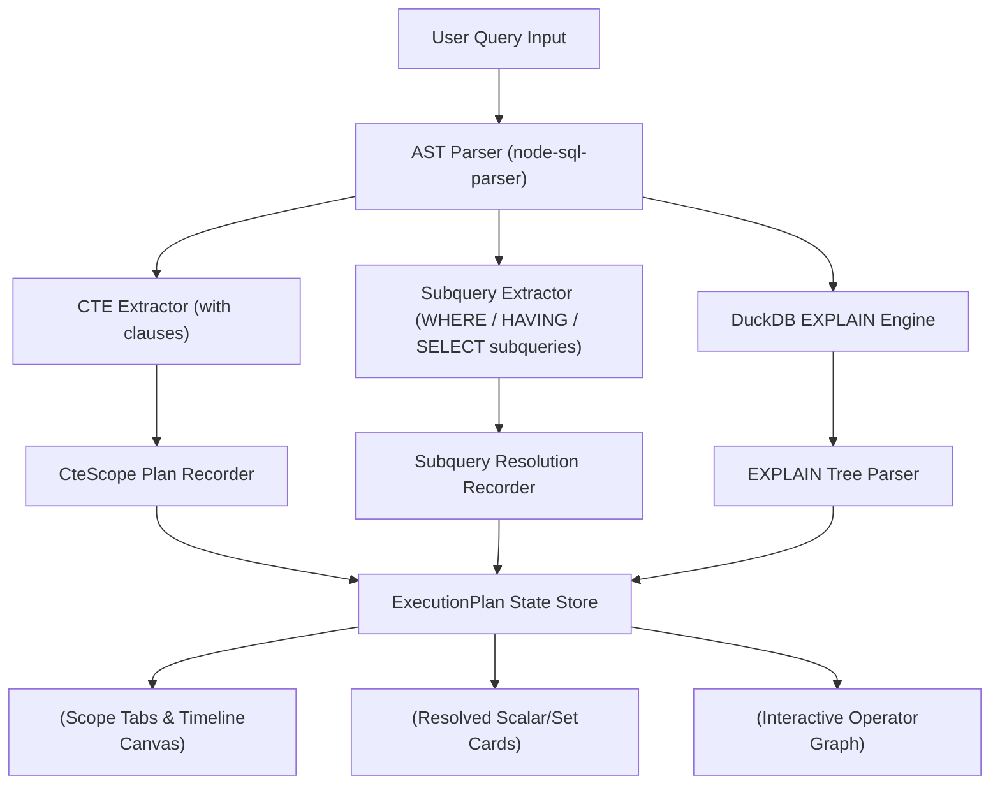

# Phase 3 Technical Design Specification: CTEs, Subqueries & Physical Execution Plan Graphs

## 1. Executive Summary

Phase 3 extends the SQL IDE + Query Debugger + Execution Visualizer with support for Common Table Expressions (CTEs via `WITH` clauses), subquery evaluations (`IN`, `EXISTS`, scalar, correlated subqueries), and an interactive physical execution plan tree powered by DuckDB WASM's `EXPLAIN` engine.

---

## 2. Architecture & System Flow



### 2.1 CTE Scope Partitioning (`WITH ... AS (...)`)
1. **Parser Layer**: `node-sql-parser` extracts the `with` array from the query AST. Each entry contains `name` (the alias) and `stmt` (the CTE subquery AST).
2. **Recorder Layer**: For each CTE:
   - Execute the CTE query on DuckDB WASM.
   - Register a dedicated `CteScope` object containing `scopeId`, `aliasName`, `query`, and its own sequence of `events` (`ExecutionEvent[]`).
   - Create a temporary table in DuckDB (`CREATE TEMP TABLE <alias> AS ...`) so subsequent CTEs and the main query can reference it natively.
3. **Main Query Layer**: After recorded CTE scopes finish, the main query executes and logs its own `ExecutionEvent[]` pipeline in the `'main'` scope.

### 2.2 Subquery Resolution (`IN`, `EXISTS`, Scalar)
1. **Scalar Subqueries**: Queries like `WHERE r.score > (SELECT AVG(score) FROM reviews)` are recorded by evaluating the inner scalar expression, yielding a `resolvedValue` (e.g. `8.2`).
2. **Set Subqueries (`IN`)**: Queries like `WHERE m.movie_id IN (SELECT movie_id FROM reviews WHERE score >= 9)` yield a `resolvedSet` (e.g. `[1, 3, 5]`).
3. **Existence Subqueries (`EXISTS`)**: Queries like `WHERE EXISTS (SELECT 1 FROM reviews r WHERE r.movie_id = m.movie_id)` yield a boolean `existsResult`.
4. **Predicate Integration**: Evaluated subquery results are attached to `PredicateNode` instances (`subquery` field) and displayed as resolved value badges in the 3-valued boolean evaluation tree.

### 2.3 Physical Execution Plan Graph (`EXPLAIN`)
1. **Execution**: Call `executeQuery("EXPLAIN " + query)` on DuckDB WASM.
2. **Tree Parsing**: Parse the JSON or formatted text output produced by DuckDB into a hierarchical `ExplainNode` AST tree.
3. **Operator Mapping**: Map raw operator strings (`HASH_JOIN`, `SEQ_SCAN`, `PROJECTION`, `FILTER`, `UNGROUPED_AGGREGATE`, `PERFECT_HASH_GROUP_BY`) into styled node cards with type badges, output row estimates, and execution duration.

---

## 3. Data Structures & Type Extensions (`src/types/index.ts`)

```typescript
export interface SubqueryResolution {
  id: string;
  type: 'scalar' | 'set' | 'exists';
  rawQuery: string;
  resolvedValue?: RowValue;
  resolvedSet?: RowValue[];
  existsResult?: boolean;
  parentClause: 'WHERE' | 'HAVING' | 'SELECT';
}

export interface CteScope {
  id: string;
  aliasName: string;
  query: string;
  events: ExecutionEvent[];
  outputRows: DataRow[];
}

export interface ExplainNode {
  id: string;
  operatorType: string;
  description: string;
  timingMs?: number;
  cardinality?: number;
  children: ExplainNode[];
}

// Extension to ExecutionPlan
export interface ExecutionPlan {
  query: string;
  stages: OperationType[];
  events: ExecutionEvent[];
  finalResult: DataRow[];
  columns: string[];
  cteScopes?: CteScope[];
  explainTree?: ExplainNode;
}

// Extension to ExecutionEvent
export interface ExecutionEvent {
  // Existing fields...
  subqueryResolutions?: SubqueryResolution[];
}
```

---

## 4. Component Specification

### 4.1 View Mode & Scope Header
- Added to `<ExecutionVisualizer />`:
  - **View Mode Switch**: `[ Relational Pipeline | Physical EXPLAIN Tree ]`.
  - **Scope Tab Bar** (when `cteScopes` exist): `[ Main Query ] [ CTE: top_directors ] [ CTE: high_scores ]`.

### 4.2 `<CteVisualizer />` (`src/visualizer/CteVisualizer.tsx`)
- Renders active CTE scope header badge (`WITH top_directors AS ...`).
- Displays the isolated step-by-step pipeline graph for the selected CTE scope.
- Previews the resulting intermediate relation table produced by the CTE before consumption in downstream queries.

### 4.3 `<SubqueryVisualizer />` (`src/visualizer/SubqueryVisualizer.tsx`)
- Renders expandable subquery cards in predicate inspection drawers.
- Displays raw subquery SQL, subquery type (`SCALAR`, `SET (IN)`, `EXISTS`), and evaluated result values.

### 4.4 `<ExplainTreeVisualizer />` (`src/visualizer/ExplainTreeVisualizer.tsx`)
- Interactive canvas rendering the hierarchical `ExplainNode` operator graph.
- Styled node cards for operators (`HASH_JOIN` in purple, `SEQ_SCAN` in cyan, `FILTER` in amber, `AGGREGATE` in emerald).
- Displays operator timing (`timingMs`) and cardinality estimates.

---

## 5. Design Constraints & Aesthetics
- Dark theme palette matching `#0B0D10` base, `#111418` primary surface, `#7C9CFF` accent.
- JetBrains Mono font for SQL snippets and operator nodes.
- Zero ungrounded decorative animations. All visual elements correspond directly to underlying relational engine state.

---

## 6. Test Plan

1. **Type & Utility Tests** (`src/__tests__/types.test.ts`):
   - Instantiate `CteScope`, `SubqueryResolution`, and `ExplainNode` interfaces.
2. **Execution Recorder Tests** (`src/__tests__/executionRecorder.test.ts`):
   - Record queries with `WITH` clause CTEs and verify `cteScopes` population.
   - Record queries with `WHERE ... IN (SELECT ...)` subqueries and verify `subqueryResolutions`.
   - Record `EXPLAIN` query output and verify `explainTree` AST generation.
3. **Component Unit Tests**:
   - `src/__tests__/CteVisualizer.test.tsx`: Scope tab switching and CTE pipeline rendering.
   - `src/__tests__/SubqueryVisualizer.test.tsx`: Subquery card rendering and scalar/set value displays.
   - `src/__tests__/ExplainTreeVisualizer.test.tsx`: Explain tree operator node rendering and click interactions.
4. **End-to-End Integration Suite** (`src/__tests__/phase3.test.ts`):
   - Complete end-to-end execution of CTE + Subquery benchmark queries across full application stack.
