# Phase 4 Technical Design Specification: Custom Data Import/Export, Visual Query Builder & History Profiler

## 1. Executive Summary

Phase 4 completes the SQL IDE + Query Debugger + Execution Visualizer application. It equips users with custom file import capabilities (CSV, JSON, Parquet) via DuckDB WASM buffer registration, result data exporting (CSV, JSON, Parquet), an interactive drag-and-drop Visual Query Builder synchronized with the Monaco SQL Editor, and an IndexedDB-backed Query History, Saved Snippets, and Performance Profiling panel.

---

## 2. Architecture & Data Flow

```mermaid
flowchart TD
    subgraph Data Import & Export
        A1["User File (CSV / JSON / Parquet)"] --> A2["FileDropzone (FileReader API)"]
        A2 --> A3["DuckDB WASM (registerFileBuffer)"]
        A3 --> A4["Database Explorer (Live Schema Update)"]
        A5["Result Grid Export Trigger"] --> A6["DuckDB COPY TO Buffer"]
        A6 --> A7["Browser Blob Download (CSV/JSON/Parquet)"]
    end

    subgraph Visual Query Builder
        B1["Visual Query Builder UI"] --> B2["Table Nodes & Column Checkboxes"]
        B1 --> B3["Join Connectors & Predicate Controls"]
        B2 & B3 --> B4["AST Generator"]
        B4 --> B5["Monaco SQL Editor Text Sync"]
    end

    subgraph History & Profiling
        C1["Query Execution Event"] --> C2["IndexedDB History Store"]
        C2 --> C3["HistoryPanel (Timeline & Snippets)"]
        C3 --> C4["Performance Profiler (Run Comparison Delta ms)"]
    end
```



---

## 3. Data Structures & Type Extensions (`src/types/index.ts`)

```typescript
export type ExportFormat = 'csv' | 'json' | 'parquet';

export interface CustomFileImport {
  tableName: string;
  fileName: string;
  fileSize: number;
  format: 'csv' | 'json' | 'parquet';
  rowCount: number;
  columns: ColumnMeta[];
}

export interface QueryHistoryItem {
  id: string;
  sql: string;
  timestamp: number;
  durationMs: number;
  rowCount: number;
  status: 'success' | 'error';
  errorMessage?: string;
  isFavorite?: boolean;
  tags?: string[];
}

export interface SavedSnippet {
  id: string;
  title: string;
  sql: string;
  description?: string;
  tags: string[];
  createdAt: number;
}

export interface VisualQueryNode {
  id: string;
  tableName: string;
  selectedColumns: string[];
  alias?: string;
  position: { x: number; y: number };
}

export interface VisualJoinEdge {
  id: string;
  leftTable: string;
  leftColumn: string;
  rightTable: string;
  rightColumn: string;
  joinType: 'INNER' | 'LEFT' | 'RIGHT' | 'FULL';
}

export interface VisualFilterCondition {
  id: string;
  table: string;
  column: string;
  operator: '=' | '!=' | '>' | '>=' | '<' | '<=' | 'LIKE' | 'IN';
  value: string;
}

export interface VisualQueryState {
  nodes: VisualQueryNode[];
  joins: VisualJoinEdge[];
  filters: VisualFilterCondition[];
  limit?: number;
}
```

---

## 4. Component Specification

### 4.1 Custom Data Import & Export
- **`<FileDropzone />` (`src/schema/FileDropzone.tsx`)**:
  - Integrated into the `DatabaseExplorer` sidebar.
  - Supports drag-and-drop or file picker for `.csv`, `.json`, `.parquet`.
  - Reads ArrayBuffer via `FileReader` API, calls `duckdb.registerFileBuffer(fileName, buffer)`, and executes `CREATE TABLE <tableName> AS SELECT * FROM read_csv_auto(...)` (or `read_json_auto` / `read_parquet`).
  - Refreshes `DatabaseExplorer` schema state upon successful import.
- **Result Grid Export (`src/grid/ResultGrid.tsx`)**:
  - Export toolbar with format selection buttons: `[ Export CSV ] [ Export JSON ] [ Export Parquet ]`.
  - Generates blob download link directly from DuckDB WASM query execution output.

### 4.2 Visual Query Builder (`src/builder/VisualQueryBuilder.tsx`)
- **Integration**: Toggle tab header in center main workspace: `[ Monaco Editor | Visual Query Builder ]`.
- **Canvas Features**:
  - Table selection dropdown or drag-from-sidebar to add table cards.
  - Column checkboxes to select projections.
  - Interactive join line connections between table columns.
  - Join type selector modal (`INNER`, `LEFT`, `RIGHT`, `FULL`).
  - Filter condition rows (`WHERE` clause generator).
- **SQL Synchronization**: Automatically builds clean, formatted SQL text using `VisualQueryState` and updates the workspace store SQL query string in real-time.

### 4.3 History & Performance Profiling Panel (`src/history/HistoryPanel.tsx`)
- **Integration**: Tabbed navigation in left sidebar: `[ Database Explorer | History & Snippets ]`.
- **History List**: Displays executed queries chronologically with execution timestamp, status badge, row count, and duration (`durationMs`).
- **Saved Snippets**: Mark queries as favorites with custom title and tags.
- **Performance Profiler**: Select any two history items to compare execution metrics (`durationMs` delta, percentage speedup/slowdown, row throughput).

---

## 5. Persistence Strategy (`IndexedDB` & `localStorage`)

- **History Store**: Persisted in `IndexedDB` via lightweight wrapper to handle unlimited history records without clogging `localStorage` limits.
- **Saved Snippets**: Persisted in `localStorage` under `sql_viewer_snippets`.
- **Custom Tables**: Persisted in active DuckDB WASM memory session.

---

## 6. Design System & Constraints
- Dark theme matching `#0B0D10` base, `#111418` surface, `#7C9CFF` accent.
- JetBrains Mono font for SQL code snippets and table column names.
- Zero AI slop: concise, high-utility UI elements with clean keyboard accessibility.

---

## 7. Test Plan

1. **Type & State Unit Tests** (`src/__tests__/types.test.ts`, `src/__tests__/historyStore.test.ts`):
   - Verify `CustomFileImport`, `QueryHistoryItem`, `SavedSnippet`, and `VisualQueryState` data structures.
2. **File Import & Export Unit Tests** (`src/__tests__/fileImport.test.ts`):
   - Test CSV, JSON, and Parquet file handle registration in DuckDB WASM.
   - Verify table creation from registered file buffers.
3. **Visual Query Builder Tests** (`src/__tests__/VisualQueryBuilder.test.tsx`):
   - Verify node addition, column selection, join edge creation, and SQL string generation.
4. **History & Profiler Tests** (`src/__tests__/HistoryPanel.test.tsx`):
   - Test history item recording, snippet saving, and run comparison delta calculation.
5. **End-to-End Phase 4 Integration Suite** (`src/__tests__/phase4.test.ts`):
   - Complete end-to-end execution of custom file import, visual query construction, execution debugging, result export, and history profiling across full stack.
